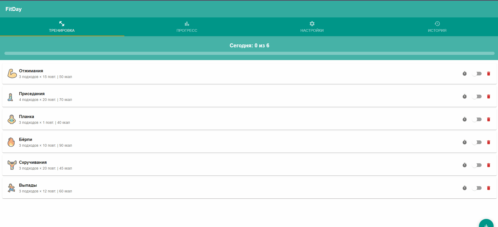

# FitDay — Трекер тренировок

Веб-приложение для отслеживания ежедневных тренировок. Реализовано как полноценный клиент-серверный проект с React-фронтендом, Node.js API и PostgreSQL базой данных.

## Функциональность

- **Тренировка** — список упражнений с возможностью отметки выполнения (Switch), добавления (+) и удаления
- **Прогресс** — визуальные прогресс-бары по трём целям: упражнения, калории, время
- **Настройки** — переключатели уведомлений, звука, вибрации и ползунок цели калорий
- **История** — сохранение результатов дня с отображением карточек по датам
- **Таймер** — экран обратного отсчёта (30 сек) для каждого упражнения с кнопками Старт/Пауза/Сброс

## Технологии

| Компонент  | Технология             |
|------------|------------------------|
| Frontend   | React 18 + Material UI |
| Backend    | Node.js + Express      |
| БД         | PostgreSQL 16          |
| Контейнеры | Docker + Docker Compose|

## Запуск

```bash
docker-compose up -d --build
```

Приложение будет доступно по адресу: **http://localhost:3000**

API доступен на: **http://localhost:5000/api**

## Остановка

```bash
docker-compose down
```

Данные сохраняются в Docker volume `pgdata` и не теряются при перезапуске.

## Структура проекта

```
├── backend/
│   ├── Dockerfile
│   ├── package.json
│   └── server.js
├── frontend/
│   ├── Dockerfile
│   ├── nginx.conf
│   ├── package.json
│   ├── public/
│   │   └── index.html
│   └── src/
│       ├── index.js
│       ├── App.js
│       └── components/
│           ├── WorkoutTab.js
│           ├── ProgressTab.js
│           ├── SettingsTab.js
│           ├── HistoryTab.js
│           └── TimerScreen.js
├── db/
│   └── init.sql
├── docker-compose.yml
└── README.md
```

## API эндпоинты

| Метод    | URL                          | Описание                     |
|----------|------------------------------|------------------------------|
| `GET`    | `/api/exercises`             | Список упражнений            |
| `POST`   | `/api/exercises`             | Добавить упражнение          |
| `PATCH`  | `/api/exercises/:id/toggle`  | Переключить выполнение       |
| `DELETE` | `/api/exercises/:id`         | Удалить упражнение           |
| `POST`   | `/api/exercises/reset`       | Сбросить все отметки         |
| `GET`    | `/api/history`               | История тренировок           |
| `POST`   | `/api/history/finish`        | Завершить день               |
| `GET`    | `/api/settings`              | Получить настройки           |
| `PUT`    | `/api/settings`              | Обновить настройки           |
| `GET`    | `/api/health`                | Проверка состояния           |

## 🎥 Демонстрация



## 🧑‍💻 Автор

[Dowilt](https://github.com/Dowilt)
